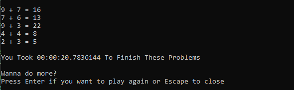
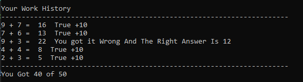

# Math Game

## Table of Contents

1. [Overview](#overview)
2. [Features](#features)
3. [How to Play](#how-to-play)
4. [Classes](#classes)
   - [Program.cs](#programcs)
   - [MathGame.cs](#mathgamecs)
   - [Check.cs](#checkcs)
   - [Problems.cs](#problemscs)
   - [Operations.cs](#operationscs)
   - [IOperations.cs](#ioperationscs)
   - [IProblems.cs](#iproblemscs)
5. [Screenshots](#screenshots)
6. [Extending the Game](#extending-the-game)
   - [Adding a New Operation](#adding-a-new-operation)
   - [Adding a New Difficulty Level](#adding-a-new-difficulty-level)
7. [Why is it Easy to Extend?](#why-is-it-easy-to-extend)
8. [Project Structure](#project-structure)

---

## Overview

    Math Game is a simple and interactive console-based game designed to help users practice and improve their math skills. The game features various mathematical operations and different difficulty levels, making it suitable for users of all ages and skill levels. The game is also extensible, allowing developers to easily add new operations or difficulty levels.

    This project is the result of a C# Object-Oriented Programming (OOP) course, demonstrating the application of OOP principles such as encapsulation, inheritance, and polymorphism.

## Features

- **Multiple Operations**: Addition, Subtraction, Multiplication, Division, Modulus, and Square.
- **Difficulty Levels**: Easy, Medium, Hard, and Super Hard.
- **Random Operation**: A feature that selects a random operation for each problem.
- **Extensibility**: Easily add new operations or difficulty levels.

## How to Play

1. **Start the Game**: Press `Enter` to start the game.
2. **Select Operation**: Choose an operation from the main menu by pressing the corresponding number key.
3. **Select Difficulty**: Choose a difficulty level by pressing the corresponding number key.
4. **Solve Problems**: Solve the presented math problems by entering your answers.
5. **View Results**: After completing the problems, view your score and history of answers.

## Classes

### `Program.cs`

- **Purpose**: Entry point of the application. Handles user input and controls the game flow.
- **Key Methods**:
  - `Main`: Main method that initializes the game and handles user interactions.

### `MathGame.cs`

- **Purpose**: Contains the core game logic.
- **Key Methods**:
  - `Start`: Starts the game with the selected operation and problems.
  - `PrintingProblems`: Prints the next problem.
  - `RecordingSolutions`: Records the user's solution.
  - `History`: Displays the game history and score.

### `Check.cs`

- **Purpose**: Handles recording and checking user solutions.
- **Key Methods**:
  - `Recording`: Records user input.
  - `Checking`: Checks the recorded inputs against the solutions.
  - `Printing`: Prints the history and score.
  - `Register`: Registers a problem.

### `Problems.cs`

- **Purpose**: Defines problem generation and difficulty levels.
- **Key Classes**:
  - `Base`: Base class for handling common problem functionalities.
  - `Easy`, `Medium`, `Hard`, `SuperHard`: Classes for different difficulty levels, inheriting from `Base`.

### `Operations.cs`

- **Purpose**: Defines various mathematical operations.
- **Key Classes**:
  - `Add`, `Subtract`, `Multiply`, `Division`, `Modules`, `Square`: Classes for specific operations, implementing the `IOperations` interface.
  - `RandomOperation`: Class for performing a random operation, implementing the `IOperations` interface.

### `IOperations.cs`

- **Purpose**: Interface for defining operations.
- **Key Methods**:
  - `Sign`: Gets the operation sign as a string.
  - `Excute`: Executes the operation and returns the result.
  - `OperandsNumber`: Gets the number of operands required for the operation.

### `IProblems.cs`

- **Purpose**: Interface for defining problem-related functionalities.
- **Key Methods**:
  - `Excute`: Executes operations and generates problems.
  - `Printing`: Prints a problem statement.
  - `GetProblems`: Gets a problem statement.
  - `GetSolutions`: Gets a solution.
  - `GetProblemsNumber`: Gets the number of problems.

## Screenshots

- **Main Menu**:  
  

- **Select Difficulty**:  
  

- **Solve Problems**:  
  

- **View Results**: 

## Extending the Game

    This project is designed to be highly extensible, allowing you to easily add new operations or difficulty levels without modifying the core logic. Below are the steps to extend the game:

### Adding a New Operation

1. **Create a New Class**: Create a new class that implements the `IOperations` interface.
2. **Implement Required Methods**:
   - `Sign`: Returns the operation sign as a string (e.g., `+`, `-`, `*`).
   - `Excute`: Performs the operation and returns the result.
   - `OperandsNumber`: Specifies the number of operands required for the operation.
3. **Add to Random Operations**: If you want the new operation to be included in random selections, add it to the `RandomOperation` class.

#### Example: Adding a Power Operation

```csharp
public class Power : IOperations
{
    public string Sign() => "^";
    public double Excute(double[] operands) => Math.Pow(operands[0], operands[1]);
    public int OperandsNumber() => 2;
}
```

---

### Adding a New Difficulty Level

1. **Create a New Class**: Create a new class that inherits from the `Base` class and implements the `IProblems` interface.
2. **Implement the `Excute` Method**: Define the range of numbers or complexity for the new difficulty level.
3. **Update Main Menu**: Modify the main menu and difficulty selection logic in `Program.cs` to include the new difficulty level.

### Example: Adding an "Expert" Difficulty Level

```csharp
public class Expert : Base, IProblems
{
    public Expert() : base() { }

    public override void Excute()
    {
        // Define the range for expert-level problems
        MinNumber = 100;
        MaxNumber = 1000;
    }
}
```

## Why is it Easy to Extend?

- **Modular Design**: The game is built using interfaces and base classes, making it easy to add new functionality without affecting existing code.
- **Clear Separation of Concerns**: Each component (e.g., operations, problems, difficulty levels) is isolated, allowing for independent updates.
- **Minimal Code Changes**: Adding new features typically requires only a few lines of code, as demonstrated above.

## Project Structure

- `Program.cs`: Main entry point of the game.
- `MathGame.cs`: Contains the core game logic.
- `Check.cs`: Handles recording and checking user solutions.
- `Problems.cs`: Defines problem generation and difficulty levels.
- `Operations.cs`: Defines various mathematical operations.
- **Interfaces**:
  - `IOperations.cs`: Defines the interface for operations.
  - `IProblems.cs`: Defines the interface for problems.

---

Feel free to extend and modify the game as per your requirements! Enjoy playing and learning! 🎮🧮
